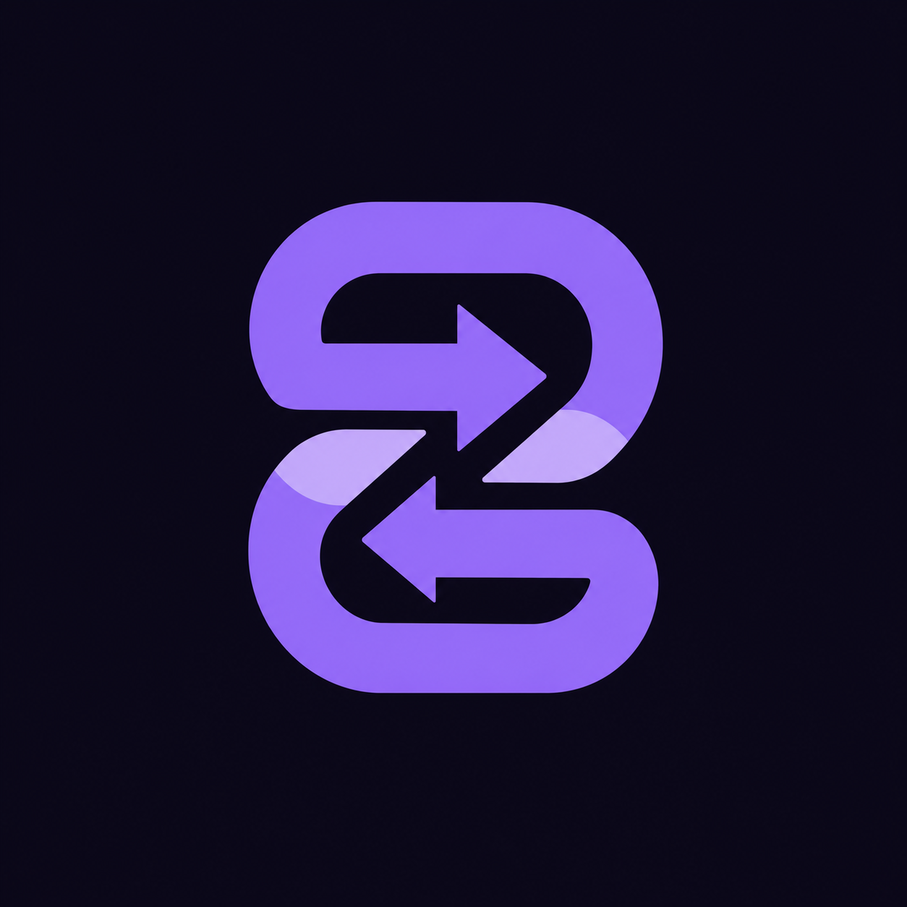

# Bit-Share

  

### Guarda el contenido que tienes derecho a conservar.

Una herramienta local de BitStation para Android y Windows: recibe o pega un
enlace, muestra las opciones compatibles y guarda el archivo directamente en
tu dispositivo.

**Sin cuentas de Bit-Share, sin anuncios y sin una nube intermedia.** El
procesamiento se hace en tu equipo. Cuando un sitio exige autenticación, la
aplicación solicita de forma explícita usar una sesión local del navegador; no
captura contraseñas ni reutiliza sesiones de otras aplicaciones.

Creado por [Eduardo Javier Olórtigue Samanamud](https://github.com/BitStationBusiness)
y BitStation.

## Por qué Bit-Share

| Bit-Share | Descargadores web convencionales |
| --- | --- |
| El enlace se procesa localmente | El enlace se entrega a un servidor externo |
| Selección de audio o resoluciones disponibles | Opciones limitadas por el sitio |
| Sin cuenta, anuncios ni suscripción de Bit-Share | Frecuentemente con anuncios, cuentas o límites |
| Runtime Windows incluido en el instalador | Dependencias y extensiones por separado |

## Qué puedes hacer

- Recibir enlaces desde el menú **Compartir** en Android.
- Pegar un enlace en Windows y elegir audio o vídeo.
- Consultar las resoluciones y tamaños que el origen público expone antes de
  iniciar la descarga.
- Guardar los archivos en tu dispositivo con progreso, cancelación y
  comprobación de espacio disponible.
- Usar un navegador local (Chrome, Edge o Firefox en Windows) únicamente si
  un sitio compatible requiere iniciar sesión.
- Descargar contenido propio, autorizado o permitido por el proveedor.

Bit-Share no elimina DRM, no sortea pagos, no accede a contenido privado sin
autorización y no garantiza compatibilidad con cada enlace: la disponibilidad
depende del sitio de origen, sus permisos y sus cambios técnicos.

## Descargar Bit-Share 1.0.2

### Windows 64-bit

1. Descarga \`Bit-Share-Setup-1.0.2.exe\` desde
   [Releases](https://github.com/BitStationBusiness/Bit-Share/releases).
2. Ejecútalo y elige el idioma.
3. El instalador deja Bit-Share en \`C:\\Bit-Share\` e incluye el runtime que
   necesita para funcionar.

### Android

1. Descarga \`Bit-Share-v1.0.2.apk\` desde
   [Releases](https://github.com/BitStationBusiness/Bit-Share/releases).
2. Ábrelo en Android y autoriza la instalación desde esa fuente si el sistema
   lo solicita.
3. Desde cualquier aplicación, usa **Compartir** y selecciona **Bit-Share**.

## Desarrollo y verificación

\`\`\`powershell
cd apps/bit_share_flutter
flutter pub get
flutter analyze
flutter test
\`\`\`

Para construir ambos distribuibles firmados localmente:

\`\`\`powershell
powershell -ExecutionPolicy Bypass -File tools/build_release.ps1
\`\`\`

El script prepara el runtime de Windows, genera el APK Android firmado y crea
el instalador con Inno Setup. La llave de publicación se conserva fuera del
repositorio mediante protección DPAPI de Windows.

## Hoja de ruta

- [x] Receptor Android para enlaces y archivos compatibles.
- [x] Selección de audio y resolución en Android y Windows.
- [x] Cliente Windows con descarga local y sesión de navegador opcional.
- [x] Instalador Windows 64-bit para \`C:\\Bit-Share\`.
- [ ] Mejoras de compatibilidad conforme evolucionen los sitios compatibles.
- [ ] Experiencia Web con funciones que el navegador permita de forma nativa.

## ☕ Mantén libres las herramientas de BitStation

Bit-Share se crea de forma independiente, sin anuncios, sin cuentas de pago y
sin suscripciones. Si te resulta útil y quieres apoyar su mantenimiento,
puedes invitarme a un café. Es voluntario y no desbloquea funciones.

---

*Bit-Share es software independiente de BitStation. Respeta los derechos de
autor, las licencias aplicables y las condiciones del sitio desde el que
guardas contenido.*
