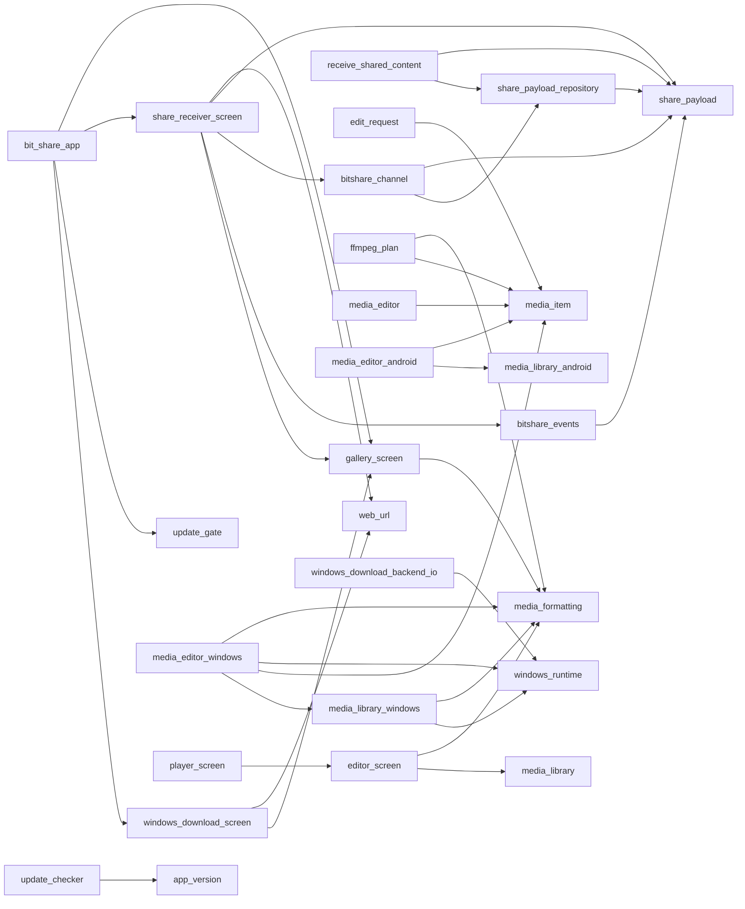

# Grafo de dependencias (generado)

Generado por análisis estático de imports. Regenerar tras cambios grandes en
`lib/` con:

```bash
cd apps/bit_share_flutter/lib
for f in $(find . -name "*.dart" | sort); do
  grep -oE "import '(package:bit_share_flutter/[^']+|\.\./[^']+|\./[^']+)'" "$f" \
    | sed -E "s/import '//;s/'$//" | sed "s|^|$f|;s|^|EDGE:|"
done
```

## Dart (lib/) — grafo de imports internos



Nodos sin aristas salientes/entrantes relevantes (hojas u hoja+plataforma):
`app_strings`, `task_state`, `access_level`, `input_kind`, `edit_request`,
`gallery/media_item`, `media_library` (interfaz + stub/io/android/windows por
`dart:io`/condicional, no por import directo), `update_dialog`,
`update_installer`, `update_release`, `windows_download_backend` (interfaz +
stub/io), `windows_download_models`, `core/web_url`, `core/windows_runtime`,
`provider_login`, `main.dart` (entry, bootstrap).

## Regla de capas (de ARCHITECTURE.md, verificada por el grafo)

```
app/ (UI, tema, composición)
  └─> features/* (pantallas por capacidad)
        └─> domain/{entities,repositories,usecases} (Dart puro, sin Flutter/Android)
        └─> core/* (formatting, web_url, windows_runtime — utilidades sin estado)
        └─> platform/* (MethodChannel/EventChannel Dart) ─> domain/*
```

`domain/` nunca importa `features/`, `platform/` ni `app/`. Confirmado: cero
aristas domain→afuera en el grafo de arriba.

## Multiplataforma por sufijo (patrón `_io` / `_android` / `_windows` / `_stub`)

Selección en tiempo de compilación vía `dart:library` conditional imports (no
aparece como import directo, por eso no está en el grafo de arriba):

- `media_editor.dart` → `media_editor_{android,windows,io,stub}.dart`
- `media_library.dart` → `media_library_{android,windows,io,stub}.dart`
- `windows_download_backend.dart` → `windows_download_backend_{io,stub}.dart`

## Android (Kotlin) — `android/app/src/main/kotlin/com/bitstation/bitshare/`

```
MainActivity.kt              entrada app completa
share/
  ShareReceiverActivity.kt   entrada transparente desde Sharesheet
  ShareIntentParser.kt       valida/normaliza Intent entrante
  ShareIntentLimits.kt       cuotas y MIME permitidos
bridge/
  BitSharePlugin.kt          canales Flutter<->Kotlin, eventos de Intent
auth/
  LoginSessionActivity.kt    WebView de login por proveedor
  ProviderLogin.kt           orquestación de sesión/cookies
download/
  DownloadCoordinator.kt     ejecución en background, cancelación
  PythonYtDlpEngine.kt       motor yt-dlp embebido (Python/Chaquopy)
media/
  FfmpegTools.kt             invocación FFmpeg
  MediaStoreRepository.kt    publicación atómica en MediaStore/Descargas
gallery/
  GalleryPlugin.kt           canal galería in-app (reemplazo galería sistema)
providers/
  ProviderRegistry.kt        allowlist de proveedores soportados
donation/
  DonationPromptPolicy.kt    lógica de cuándo mostrar prompt de donación
```

Tests unitarios: `donation/DonationPromptPolicyTest.kt`,
`providers/ProviderRegistryTest.kt`, `share/ShareIntentLimitsTest.kt`.

## Windows (nativo) — `windows/`

- `runner/`: shell Win32 estándar de Flutter (main.cpp, flutter_window,
  win32_window) — boilerplate, no tocar salvo icono/metadata.
- `runtime/`: binarios portables — `yt-dlp.exe`, `ffmpeg.exe`, `ffprobe.exe`,
  `deno.exe` (runtime JS para extractores) + `VERSIONS.txt` (hashes SHA-256).
- `CMakeLists.txt`: copia `runtime/` al paquete de release y valida presencia.
- Backend Dart (`windows_download_backend_io.dart`) invoca estos binarios sin
  shell, argumentos separados (ver `ARCHITECTURE.md`).

## Referencias cruzadas de documentación existente

- Visión de capas y contratos: [ARCHITECTURE.md](ARCHITECTURE.md)
- Listado narrativo raíz-por-raíz: [CODE_MAP.md](CODE_MAP.md)
- Seguridad (validación Intent, sandbox descargas): [SECURITY.md](SECURITY.md)
- Contrato de proveedores permitidos: [PROVIDER_CONTRACT.md](PROVIDER_CONTRACT.md)

Este archivo (`CODE_GRAPH.md`) es el mapa denso pensado para lectura por
agente: cargarlo evita re-explorar `lib/` y `android/` imports desde cero.
